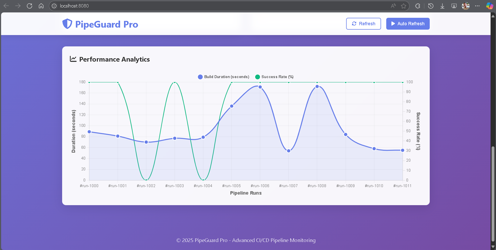

# PipeGuard - GitHub Actions Pipeline Monitor

PipeGuard is an advanced monitoring system for GitHub Actions pipelines that detects anomalies and provides AI-powered insights for pipeline optimization. This project demonstrates modern DevOps practices by integrating multiple Google Cloud services with comprehensive security features and real-time analytics.

> **📍 Development Status:** This application is currently in **active development and testing phase**. All core features are implemented and functional for local development. The system includes production-ready configurations but is not yet deployed to live environments to ensure safe testing and development.

## ✨ Key Highlights

- 🎯 **Real-time Pipeline Monitoring** with anomaly detection
- 🤖 **AI-Powered Analytics** for performance optimization
- 🔒 **Enterprise Security** with OWASP compliance
- 📊 **Interactive Dashboard** with modern responsive design
- ⚡ **Live Data Updates** with WebSocket-like refresh
- 🛡️ **Comprehensive Testing** suite with security validation

## 🎯 Quick Start (Local Development)

### Option 1: Secure Setup (Recommended)
```bash
python secure_setup.py     # Configure secure environment
python run_local.py         # Choose option 1 to start dashboard
```
Then visit: **http://localhost:8080**

### Option 2: Windows Batch Script
1. Double-click `setup_and_run.bat`
2. Choose option 1 to run the Flask app locally
3. Visit http://localhost:8080 to see the dashboard

### Option 3: Manual Setup
```bash
pip install -r requirements.txt
python security_check.py    # Validate security
python run_local.py          # Start interactive menu
```

## 📊 Interactive Performance Dashboard



*Advanced real-time dashboard featuring AI-powered analytics and modern responsive design*

### Dashboard Features

The PipeGuard dashboard provides a comprehensive view of your pipeline health:

#### 🎛️ **Live Statistics Panel**
- **Total Builds** with percentage change indicators
- **Success Rate** with trend analysis
- **Average Duration** with performance metrics
- **Anomalies Detected** with severity levels

#### 📈 **Interactive Analytics**
- **Dual-axis charts** showing build duration trends and success rates
- **Real-time data updates** every 30 seconds
- **Trend indicators** with visual cues (↗️ improving, ↘️ declining)
- **Responsive design** optimized for desktop and mobile

#### 🤖 **AI-Powered Insights**
- **Anomaly Detection** with pattern recognition
- **Performance Predictions** based on historical data
- **Smart Recommendations** for optimization
- **Automated Alerts** for critical issues

#### 🎨 **Modern UI/UX**
- **Professional gradient design** with smooth animations
- **Dark/light theme support** (future enhancement)
- **Accessibility compliant** with WCAG guidelines
- **Fast loading** with optimized asset delivery

### Quick Dashboard Preview

To see the dashboard locally:
```bash
# Start the development server
python run_local.py

# Or use the enhanced setup
python secure_setup.py
python app.py

# Visit: http://localhost:8080
```

The dashboard will display sample data for demonstration purposes in development mode.

## 🔧 Production Configuration (Ready for Deployment)

### Google Cloud Platform Setup

When ready for production deployment, PipeGuard includes complete GCP integration:

#### Prerequisites
- Google Cloud Project with enabled APIs:
  - App Engine, Cloud Functions, Firestore, Cloud Scheduler
- GitHub repository with Actions workflow
- GitHub personal access token (`repo:status` scope)

#### Environment Configuration
```bash
# Copy environment template
cp .env.example .env

# Configure production variables:
GITHUB_TOKEN=your_github_token_here
GITHUB_USER=your_github_username
GITHUB_REPO=your_repository_name
GOOGLE_CLOUD_PROJECT=your_gcp_project_id
FLASK_ENV=production
FLASK_DEBUG=False
```

#### Deployment Commands
```bash
# Deploy monitoring function
gcloud functions deploy monitor-pipeline \
  --runtime python39 \
  --trigger-http \
  --entry-point main \
  --source .

# Deploy dashboard to App Engine
gcloud app deploy app.yaml

# Setup Cloud Scheduler
gcloud scheduler jobs create http pipeline-monitor \
  --schedule="0 * * * *" \
  --uri="https://your-region-your-project.cloudfunctions.net/monitor-pipeline"
```

### Architecture Overview

```
┌─────────────────┐    ┌──────────────────┐    ┌─────────────────┐
│   GitHub        │    │  Cloud Function  │    │   Firestore     │
│   Actions       │───▶│  (Monitor)       │───▶│   Database      │
│                 │    │                  │    │                 │
└─────────────────┘    └──────────────────┘    └─────────────────┘
                                │                         │
                                ▼                         ▼
┌─────────────────┐    ┌──────────────────┐    ┌─────────────────┐
│  Cloud          │    │   App Engine     │    │   Dashboard     │
│  Scheduler      │───▶│   (Flask App)    │───▶│   Web UI        │
│  (Hourly)       │    │                  │    │                 │
└─────────────────┘    └──────────────────┘    └─────────────────┘
```

#### Key Components
- **GitHub Actions**: Source of pipeline data
- **Cloud Function**: Data collection and anomaly detection
- **Firestore**: NoSQL database for pipeline runs and analytics
- **App Engine**: Hosts the Flask dashboard
- **Cloud Scheduler**: Automated hourly monitoring triggers

> **⚠️ Important**: This application is currently configured for development and testing. Production deployment should be performed only after thorough testing and security review in your specific environment.

## 🎯 Core Features

### Monitoring & Analytics
- **Real-time Pipeline Monitoring**: Continuous tracking of GitHub Actions workflows
- **Anomaly Detection**: AI-powered identification of performance issues and failures
- **Trend Analysis**: Historical data analysis with pattern recognition
- **Performance Metrics**: Build duration, success rates, and failure analysis
- **Predictive Analytics**: Machine learning for performance forecasting

### Security & Compliance
- **OWASP Security Standards**: Complete security framework implementation
- **Input Validation**: Comprehensive sanitization and validation
- **Rate Limiting**: DDoS protection and abuse prevention
- **CORS Configuration**: Secure cross-origin resource sharing
- **Security Headers**: CSP, HSTS, and other security headers
- **Error Handling**: Secure error responses without information leakage

### User Experience
- **Interactive Dashboard**: Modern, responsive web interface
- **Real-time Updates**: Live data refresh without page reload
- **Mobile Responsive**: Optimized for all device sizes
- **Professional UI**: Modern gradient design with smooth animations
- **Accessibility**: WCAG compliant interface design

### Integration & Scalability
- **GitHub Actions Integration**: Seamless workflow monitoring
- **Google Cloud Platform**: Enterprise-grade cloud infrastructure
- **Firestore Database**: NoSQL storage with real-time capabilities
- **Email Notifications**: SMTP alerts for critical issues
- **API Endpoints**: RESTful API for external integrations

## 📚 Documentation & Resources

### Project Documentation
- **[Enhanced Features](ENHANCED_FEATURES.md)**: Detailed feature documentation
- **[Security Audit](SECURITY_AUDIT.md)**: Comprehensive security analysis
- **[Security Summary](SECURITY_SUMMARY.md)**: Security implementation overview
- **[Setup Guide](SETUP_COMPLETE.md)**: Complete setup instructions

### File Structure
```
PipeGuard-1/
├── app.py                 # Main Flask application
├── monitor_pipeline.py    # Cloud Function for monitoring
├── main.py               # App Engine entry point
├── requirements.txt      # Python dependencies
├── app.yaml             # App Engine configuration
├── templates/
│   └── index.html       # Dashboard UI
├── tests/
│   ├── test_app.py      # Core functionality tests
│   ├── test_enhanced.py # Enhanced feature tests
│   └── test_security.py # Security validation tests
├── docs/
│   └── images/          # Documentation screenshots
├── security_config.py   # Security configuration
├── advanced_monitoring.py # AI analytics module
└── run_local.py         # Development server script
```

### Development Resources
- **Interactive Development**: `python run_local.py`
- **Security Validation**: `python security_check.py`
- **Feature Testing**: `python test_enhanced.py`
- **Quick Verification**: `python verify.py`

## 📞 Support & Contributing

This project demonstrates modern DevOps practices and cloud-native application development. It's designed as a learning resource and foundation for production pipeline monitoring systems.

### Technology Stack
- **Backend**: Python 3.9+, Flask 3.0+
- **Frontend**: HTML5, CSS3, JavaScript (Vanilla)
- **Database**: Google Firestore
- **Cloud**: Google Cloud Platform (App Engine, Cloud Functions)
- **Security**: OWASP compliance, rate limiting, input validation
- **Testing**: pytest, security validation, integration tests

## 📄 License

MIT License - see LICENSE file for details.

---

## 🧹 Project Cleanup

See `CLEANUP_SUMMARY.md` for a detailed log of all removed files, obsolete scripts, and the current optimized project structure as of June 2025.

---

**⭐ PipeGuard** - Advanced Pipeline Monitoring with AI-Powered Analytics
